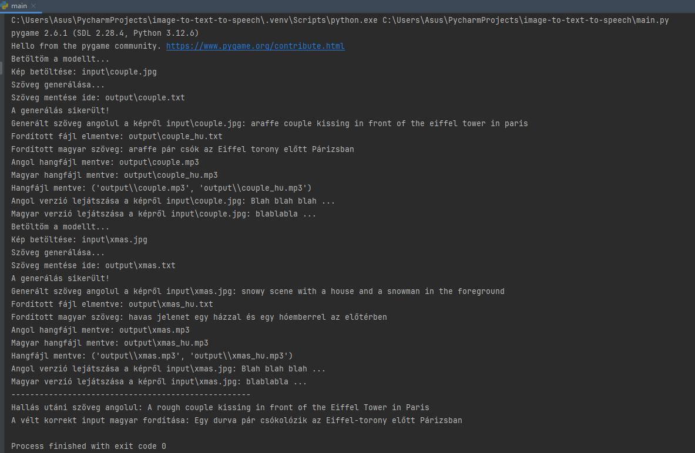

# Image-to-Hungarian Audio Translator

<div style="display: flex; align-items: center;">
  
  <p>This project processes an input image file using a pre-trained image-to-text model to generate a description of the image in English. It then translates the generated text into Hungarian and creates audio files for both the English and Hungarian texts. Finally, the project plays back the audio files aloud.
</p>
</div>

---

## Features

1. **Image-to-Text**: Generates an English caption for an input image using the BLIP model.
2. **Text Translation**: Translates the English caption to Hungarian using the MarianMT model.
3. **Text-to-Speech**: Converts both English and Hungarian text into audio files using `gTTS`.
4. **Audio Playback**: Plays both audio files sequentially using `pygame`.

---

## Prerequisites

Before running the project, ensure the following are installed:
- Python (>= 3.8) I am currently using 3.12.6 (date: 11/24/2024)
- [PyCharm](https://www.jetbrains.com/pycharm/) or any Python IDE
- Basic knowledge of terminal commands

---

## Installation

Follow these steps to set up the project:

### Step 1: Clone the Repository

```bash
git clone <repository_url>
cd <repository_directory>
```

## Directory Structure

```
project_directory/
├── input/
│   └── xxx.jpg            # Place your input image here
├── output/                # Generated files will be saved here - if not exists 
|   └── xxx.txt            # Generated txt file with English description of the file (just for test purpuses!)
|   └── xxx_hu.txt         # Generated txt file with Hungarian description of the file (just for test purpuses!) - translated by the model
|   └── xxx.mp3            # Generated mp3 audio file in English from the txt file's text
|   └── xxx_hu.mp3         # Generated mp3 audio file in Hungarian from the txt file's text
├── local_models/          # Translation model directory
│   └── opus-mt-en-hu      # Place the MarianMT model here
├── cache/                 # Cached models for image captioning
└── main.py                # The entry point for the application
```

## Hugging Face model for image to text (Cached models for image captioning):
Linux or MacOS: 
`/home/<felhasználónév>/.cache/huggingface`
Windows:
```C:\Users\<felhasználónév>\.cache\huggingface```

## Downloading the model into your local_models folder:
```bash
transformers-cli download opus-mt-en-hu --cache-dir ./local_models
```

## In case of installing one-by-one a command example: 
```bash
pip install transformers
```

## Do not forget to install all the necessary libraries 
```bash
pip install -r doc/requirements.txt
```

--------

# Run result (terminal print screen)


